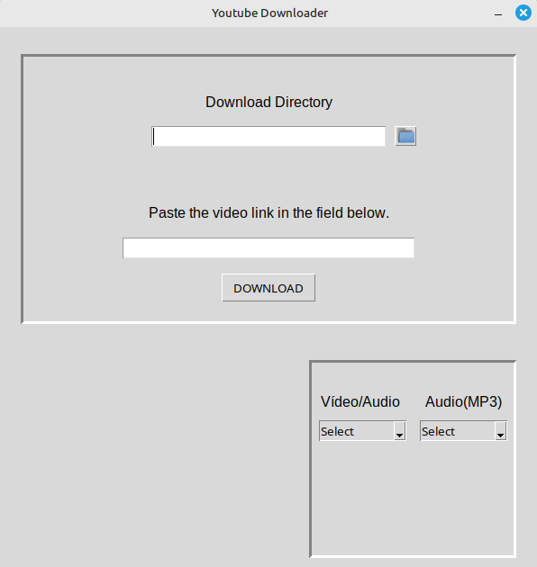

# YouTube Downloader
This is my first personal project, created to help me practice and improve my Python skills.

## Installation:
Before running the program, make sure you have the following installed: 
- [Python](https://www.python.org/)
- [FFmpeg](https://ffmpeg.org/)

## Dependencies
This project uses the following third-party library:
- [yt-dlp](https://github.com/yt-dlp/yt-dlp): Used for downloading videos from YouTube.

You can install it with:
```bash
pip install yt-dlp
``` 
## Packaging the Application
Before packaging the script, make sure you have uncommented the following lines in main.py:
```bash
183 #ffmpeg_path = resource_path("ffmpeg/ffmpeg")
```
```bash
206 #'ffmpeg_location': ffmpeg_path
```
Next, create a "ffmpeg" folder in the project directory and place the FFmpeg binary files.

To create an executable from the script using PyInstaller:

1. Install PyInstaller 
```bash
pip install -U pyinstaller
``` 
2. Execute the following command:
```bash
pyinstaller --onefile --add-binary "ffmpeg/ffmpeg:ffmpeg" --add-data "assets/icons:assets/icons" main.py
``` 

After this, the executable will be located in the "dist" folder.

## Screenshot
<p align="center">
  
</p>

## License
This project is licensed under the MIT License – see the [LICENSE](LICENSE) file for details.